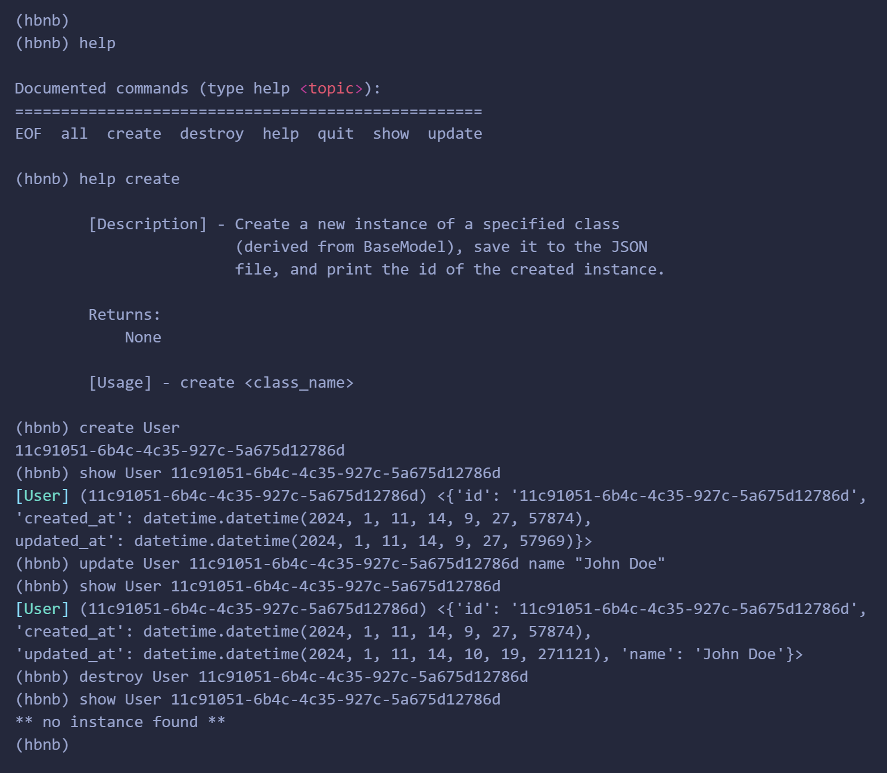

# **AirBnB clone - The console**

## **Project Description**

This is the first part of the AirBnB clone project where I worked on creating the console. It is a sandbox that aims to manipulate data without a visual interface.

This is not a client side console, It will be used development and debugging.
### Installation and Usage
___
To install, compile and run the project, clone the repository using the following command:
```
git clone https://github.com/tami-cp0/AirBnB_clone.git
```
Enter the directory and run the console using this command:
```
cd AirBnB_clone && ./console.py
```
> run `help` to see all available commands
> or run `help <command>` to Description and Usage of a command.

### Console Demo

### Operations
___
> These are the current implemented functionalities:
-  `all` - Print all instances or all instances of a specific class.
-  `create` - Create a new instance of a specified class
-  `destroy` - Deletes an instance of a specified class
-  `EOF` - Exit the console.
-  `help` - List available commands with "help" or detailed help with "help cmd".
-  `quit` -  Exit the console.
-  `show` - Prints the string representation of an instance
-  `update` - Update attributes of an instance
___
This README should give potential contributors or users a better understanding of the knowledge required to work with my AirBnB console project.

**[Author](AUTHORS):** *Oluwatamilore Olugbesan* 
**E-mail:** *<findtamilore@gmail.com>*
